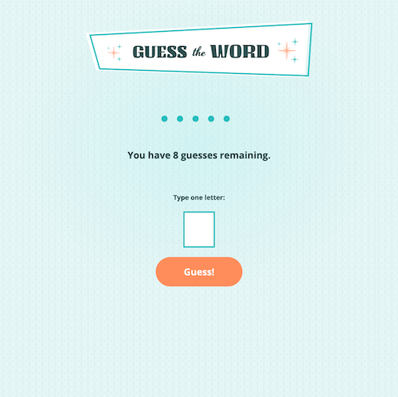
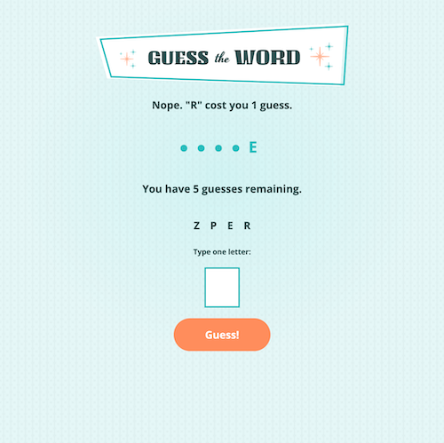

<!-- TABLE OF CONTENTS -->

  
Table of Contents

  <ol>
    <li>
      <a href="#about-the-project">About The Project</a>
      <ul>
        <li><a href="#built-with">Built With</a></li>
      </ul>
    </li>
    <li>
      <a href="#getting-started">Getting Started</a>
      <ul>
        <li><a href="#prerequisites">Prerequisites</a></li>
        <li><a href="#installation">Installation</a></li>
      </ul>
    </li>
    <li><a href="#usage">Usage</a></li>
    <li><a href="#roadmap">Roadmap</a></li>
    <li><a href="#contributing">Contributing</a></li>
    <li><a href="#license">License</a></li>
    <li><a href="#contact">Contact</a></li>
    <li><a href="#acknowledgments">Acknowledgments</a></li>
  </ol>

<!-- ABOUT THE PROJECT -->

## About The Project

This is a game built with JavaScript that implements:

-   Async and callback functions.
-   Fetching data from a hosted file.
-   Parsing data as Text.
-   for...of loops with conditionals.
-   Click event handlers with conditional statements.
-   Creating and appending HTML elements.
-   Adding and removing CSS classes.
-   RegEx validation.

Try to guess the word before you run out of attempts! Type in a single letter at a time, and watch as the game keeps track of your guesses and updates what you see on screen after each round, counting down until eventually you emerge victorious or admit defeat. Either way, hit the reset button and try your luck again.

(<a href="#readme-top">back to top</a>)

### Built With

-   HTML
-   CSS
-   JavaScript

(<a href="#readme-top">back to top</a>)

<!-- GETTING STARTED -->

## Getting Started

This web page was crafted with vanilla code. No dependencies here!

### Prerequisites

All you need is a browser (to view/interact) and a text editor (to modify).

### Installation

1. Clone this repo and you're all set!

(<a href="#readme-top">back to top</a>)

<!-- USAGE EXAMPLES -->

## Usage

-   `index.html`: structure and layout.
-   `styles.css`: design and aesthetics.
-   `script.js`: functionality.

(<a href="#readme-top">back to top</a>)

<!-- ROADMAP -->

## Roadmap

-   [ ] Difficulty level selection
-   [ ] Scoring system
    -   [ ] Fewer guesses = Higher score
    -   [ ] Score display

(<a href="#readme-top">back to top</a>)

<!-- CONTRIBUTING -->

## Contributing

If you have a suggestion that would make this better, please fork the repo and create a pull request. You can also simply open an issue with the tag "enhancement".

Thanks for playing!

(<a href="#readme-top">back to top</a>)

<!-- LICENSE -->

## License

Distributed under the [MIT License](https://choosealicense.com/licenses/mit/).

(<a href="#readme-top">back to top</a>)

<!-- CONTACT -->

## Contact

Nate: [GitHub](https://github.com/nvsmith) | [Grepper](https://www.grepper.com/profile/intra)

(<a href="#readme-top">back to top</a>)

<!-- ACKNOWLEDGMENTS -->

## Acknowledgments

#### Skillcrush - JavaScript Fundamentals

-   Module 13: Project: Guess The Word Game
-   [normalize.css](github.com/necolas/normalize.css)

#### README Template

-   [Best-README-Template](https://github.com/othneildrew/Best-README-Template/tree/master)

(<a href="#readme-top">back to top</a>)

